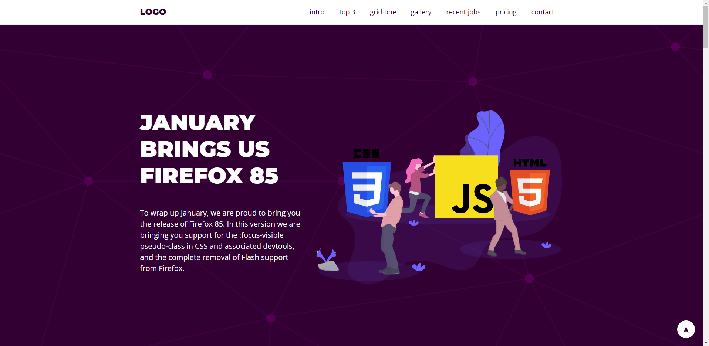

# Landing Page - Exercising HTML and CSS

> Putting into Practice what I've learnt from a course I've bought on the Udemy Platform 

This Landing Page was created following some classes I took from a course I've bought on the Udemy Platform called "JavaScript and TypeScript from basics to Adavanced". The course is ministered by 'Luiz Otávio Miranda'. Bascially, the project consists of a generic responsive landing page.

## New Topics I learnt:

- How to reuse CSS classes so as to make my code cleaner (no redundancy).
- How people create a class with the max-width of the page.
- How to create a contact section.
- How to create a pricing table section.
- How to create a responsive navegation bar with basic JS.

# Links:

- 